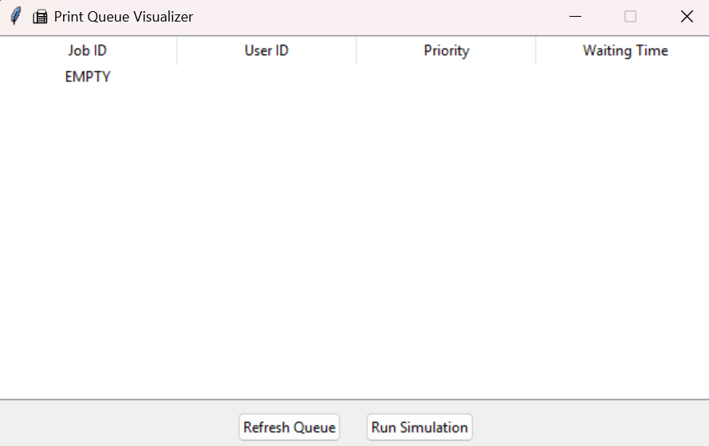
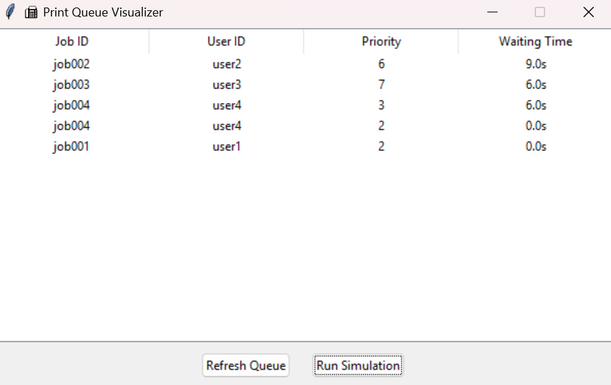

# QUEUE-Assignment – Print Queue Simulator 

## Group Name
Maria and her Minions

## Group Members

| Name            | Admission Number | Module Responsibility                     |
|-----------------|------------------|-------------------------------------------|
| Maria Muwale    | 192414           | Core Queue Management & Visualization and Reporting                    |
| Nathan Achar | 189206         | Priority & Aging System                   |
| Githinji Mugambi | 189596         | Job Expiry & Cleanup                      |
| Allan Waithaka | 191604         | Concurrent Job Submission Handling        |
| Faith Muthoni | 178509         | Event Simulation & Time Management        |

---

## Module Contributions

### Maria Muwale – Core Queue Management 
- I worked on the main print queue itself, building a circular queue that can hold a fixed number of jobs.
- I added the main operations: enqueue, dequeue, and show_status so we can add, remove, and view print jobs easily.
- Each job has details like the user ID, job ID, priority, and how long it's been waiting.
- I also made sure to handle errors properly — like when someone tries to add a job but the queue is full.

### Nathan Achar - Priority and Aging System
- The code can initialize job with additional attributes needed for aging functionality
- The code can initialize queue with aging parameters
- Update waiting time based on how long job has been in queue
- Ability to check if this job should have its priority aged
- Increase priority due to aging
- Apply aging to jobs that have waited long enough
- Find the index of the highest priority job in the circular queue
- Update waiting times for all jobs in the queue
- Manually trigger aging for all jobs (useful for testing)

### Githinji Mugambi - Job expiry
- Tracked and updated waiting_time for all jobs with each system tick.
- Automatically removed jobs that exceeded a configurable expiry time.
- Ensured expired jobs were safely removed from the circular queue without breaking queue structure.
- Maintained a log of expired jobs and provided system notifications upon expiration.
- Integrated with PrintQueue for seamless access to job metadata and queue structure.
- Code located in job_expiry_cleanup.py.

### Allan Waithaka - Concurrent Job submission handling
- The program can implement simultaneous job submissions.
- The threading-lock makes the queue thread safe.
- The use of self.lock enable there not to be race condition.
- Use of 'threading.Lock' is the synchronization part.

### Faith Muthoni - Event simulation
- It updates waiting times. For each job in the queue, it calculates how long the job has been waiting since it was added
- It checks whether it can apply priority aging. If a job has waited longer than the configured aging interval, it's priority is increased by a specified increment
- It checks whether it can remove expired Jobs. If a job's waiting time exceeds the sxpiry limit, it is considered expired and removed from the queue.
- The tick() function helps in implementing all that

### Maria Muwale - Visualization & Reporting
- Once everyone else finished their parts, I added a simple interface to visualize the current state of the queue.
- I used the tkinter library to create a GUI that shows all the jobs in the queue, including their priority and waiting time.
- There's a refresh button to update the view after each event.
- This makes it easy to see what's happening in the system without scrolling through the terminal output.

## How to run the code
- Clone the repository from GitHub using this link https://github.com/ICS-2025-GROUP-D/QUEUE_Assignment.git
- Install required dependencies such as Tkinter, by running pip install tk in the terminal
- Run the main file, which is 'main.py'. A simple GUI will pop up, and click run simulation to simulate the print jobs in the terminal and click refresh queue to view the latest state of the queue.

## Screenshots 
### Before running simulation

### After running simulation
